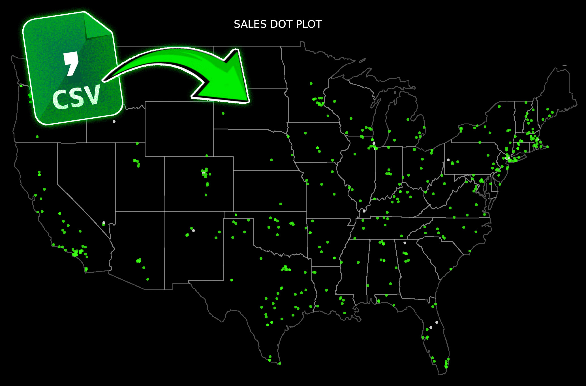
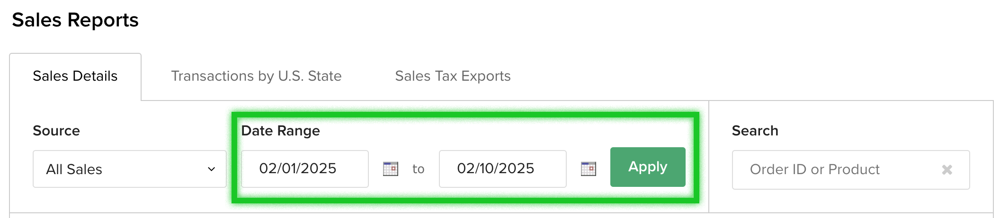
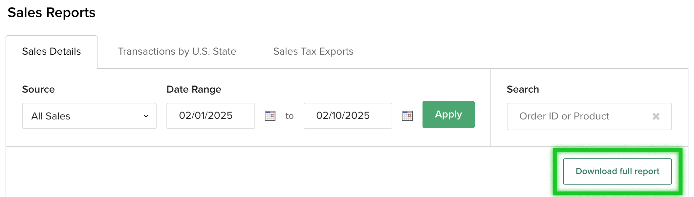

# TPT Sales Map for Teachers Pay Teachers Sellers

- Created By Receptor-01

## Overview
This script processes sales data from Teachers Pay Teachers (TPT) and generates charts to visualize sales on a map. 



Start by first downloading your teachers pay teachers product sales report at the following destination: https://www.teacherspayteachers.com/My-Sales

Apply the date range you want to map out. I think it's capped at 1 year maximum. 



Then download the full report: 



After downloading, manually rename your TPT sales report CSV to 'sales-report.csv' to ensure naming consistency. 


## Installation

1. Clone this repository:
   ```bash
   git clone https://github.com/Receptor-01/TPT-Sales-Map.git
   cd TPT-Sales-Map


## Setup with Virtual Environment

1. **Create a virtual environment** (only needed once):
   - python3 -m venv venv

2. Activate the virtual environment
    macOS/Linux 
        - source venv/bin/activate
    Windows
        - venv\Scripts\activate

3. Install dependencies
    - pip install -r requirements.txt

